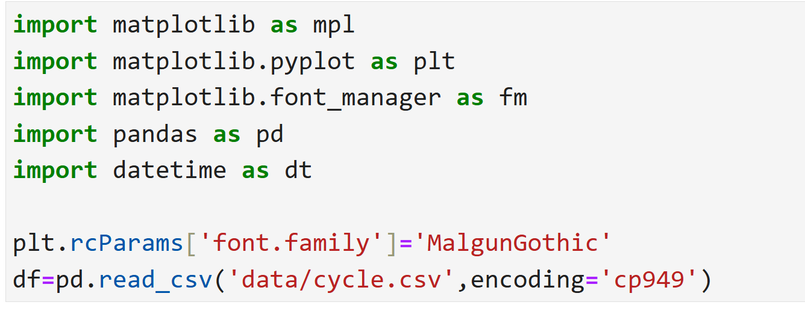
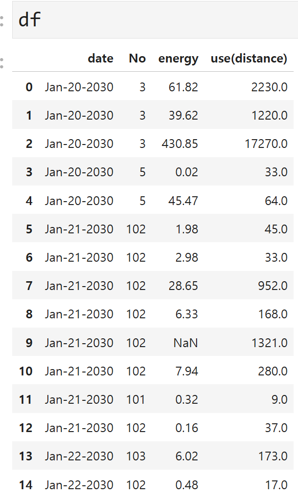

# 자전거 대여 현황 데이터 다루기

## 프로젝트 개요 및 목표

파일은 서울시 대여소별 자전거 대여 현황 및 이동거리별 운동량에 대한 데이터를 수정하고 가공한 데이터입니다.

데이터셋의 컬럼 중 일부 자료형을 변형해보고 일부 컬럼에 대하여 구간으로 나누고 데이터를 확인합니다.

결측치를 채우고 피벗테이블을 만들어 데이터를 분석하고 시각화 합니다.

## 데이터/파일

date:대여 일자

No:대여소 번호

energy:운동량

use(distance):이동거리

### 데이터 불러오기/확인

