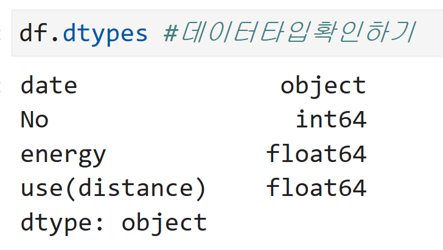
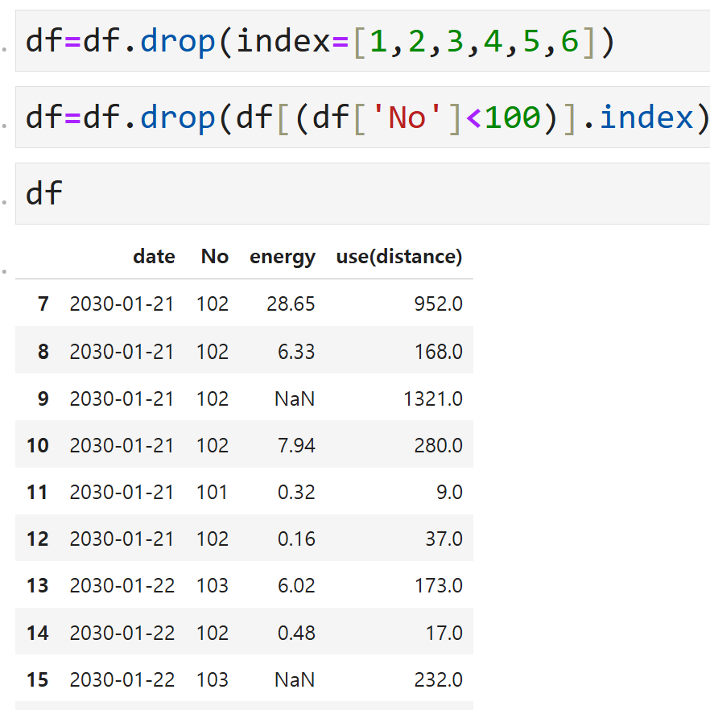

# 자전거 대여 현황 데이터 다루기

## [프로젝트 개요 및 목표]

파일은 서울시 대여소별 자전거 대여 현황 및 이동거리별 운동량에 대한 데이터를 수정하고 가공한 데이터입니다.

데이터셋의 컬럼 중 일부 자료형을 변형해보고 일부 컬럼에 대하여 구간으로 나누고 데이터를 확인합니다.

결측치를 채우고 피벗테이블을 만들어 데이터를 분석하고 시각화 합니다.

## [데이터/파일]

date:대여 일자

No:대여소 번호

energy:운동량

use(distance):이동거리

### [데이터 불러오기/확인]

### [해당파일을 dtypes,shape,info,head 확인]

### ['date'컬럼을 datetime으로 변환하기]

### ['energy'컬럼을 object형식으로 바꾸기 
###  index 1,2,3,4,5,6삭제하기
###  'No'컬럼중 100보다 작은수치를 삭제하기]

### ['energy'의 자료형을 object타입으로 변경
###  'energy'의 자료형을 수치데이터로 변경해보기(pd.to_numeric 사용,errors는 coerce로 처리)
###   결측치 'energy'평균값으로 채우기]

### ['energy'컬럼에대해 각구간별 포함개수를 고려하지않고 총 구간에 대하여 10개 구간으로 나누고 각 구간의 개수를 출력]

### ['energy'컬럼에대해 각 구간별 포함 데이터의 개수를 유사하게 설정하고 10개 구간으로 나누고 각 구간의 개수를 구하기]
